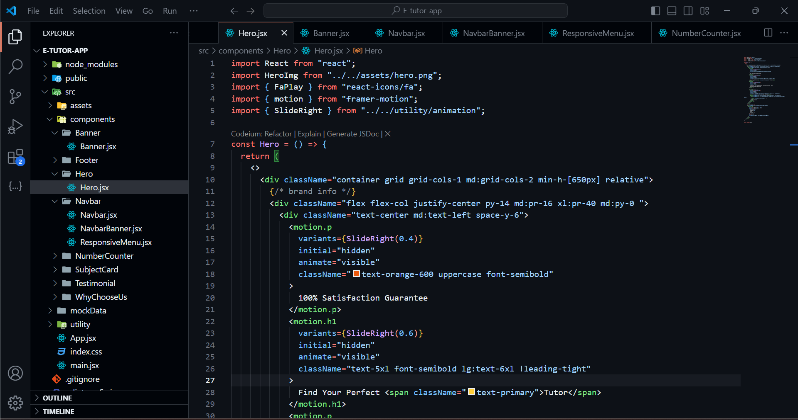

# E-tutor App 📚💻

**E-tutor App** is an online e-learning platform created using React.js. It provides a modern, user-friendly interface for students to explore courses and access educational content, optimized for a seamless learning experience across devices.

## Screenshots 📸

### Desktop View:


### Mobile View:


### VS Code Editor View:


## Features ✨

- **Responsive Design**: Adjusted for a great user experience on mobile, tablet, and desktop devices.
- **Course Catalog**: A structured course directory allowing users to explore various topics.
- **Interactive UI Components**: Engaging animations and carousels enhance the user interface.
- **Animated Transitions**: Powered by **Framer Motion** for smooth and engaging transitions.
- **Counters**: Dynamic counters using **react-countup** to show key metrics like number of courses, instructors, and students.
- **Icons**: Beautiful icons integrated with **React Icons**.
- **Carousels**: Smooth product showcases using **React Slick** and **Slick Carousel**.
- **React and Tailwind CSS**: Combines React's component-based structure with Tailwind CSS's responsive styling.
- **User Authentication**: Supports secure login and signup features for personalized course access.

## Tech Stack 🛠️

 


 


## Project Layout 🗂️

```bash
E-tutor-App/
│
├── public/
│   └── assets/
├── src/
│   ├── components/
│   ├── pages/
│   ├── styles/
│   ├── App.js
│   ├── index.js
│   └── ...
├── .gitignore
├── package.json
├── README.md
└── LICENSE
```

- **`public/`**: Static assets like images.
- **`src/`**: Source files, including components, pages, and styles.
- **`App.js`**: Main app structure.
- **`components/`**: Reusable UI elements (e.g., navbar, footer, course cards).
- **`styles/`**: Tailwind CSS and custom styles.

## Getting Started 🚀

### Prerequisites

- [Node.js](https://nodejs.org/) (version 14 or higher)
- [npm](https://www.npmjs.com/) (comes with Node.js)

### Installation

1. **Clone the Repository**:

   ```bash
   git clone https://github.com/your-username/e-tutor-app.git
   cd e-tutor-app
   ```

2. **Install Dependencies**:

   ```bash
   npm install
   ```

3. **Run the Development Server**:

   ```bash
   npm start
   ```

   Open your browser and go to `http://localhost:3000` to view the app.

## Contributing 🤝

1. **Fork the Repository**
2. **Create a New Branch**:
   ```bash
   git checkout -b feature/new-feature
   ```
3. **Commit Changes**:
   ```bash
   git commit -m "Added new feature"
   ```
4. **Push to GitHub**:
   ```bash
   git push origin feature/new-feature
   ```
5. **Open a Pull Request**.

## Live Preview 🌐

You can check out the live version of **E-tutor App** at: [E-tutor App Live](https://e-tutor-app.netlify.app)

## Contact 📬

- **LinkedIn**: [Ajay Patil](https://www.linkedin.com/in/ajaypatil1993)
- **Email**: [aj41093@gmail.com](mailto:aj41093@gmail.com)
- **GitHub**: [GitHub](https://github.com/ajaypatil1993)

## License 📝

This project is licensed under the MIT License. See the [LICENSE](LICENSE) file for details.

## Acknowledgements 🙏

- 
- 
- 
- 
- 
- 
- 
